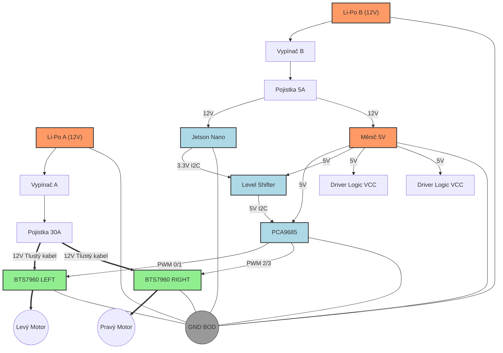

# Detailní Schéma Zapojení - WALL-E

> [!WARNING]
> Před zapojením baterie si VŽDY propípni zapojení multimetrem (kontrola zkratů)!
> Červený kabel = **+ (PLUS)**
> Černý kabel = **- (MÍNUS)** / **GND**

## 1. Napájecí Větve (Power Distribution)

Máme dva oddělené okruhy pro maximální stabilitu.

### 🔴 Okruh A: POHON (High Power)
*   **Zdroj:** Li-Po 3S (11.1V) - A
*   **Ochrana:** Li-Po Alarm A + Pojistka 30A (Nožová) + Vypínač (na + pólu)
*   **Spotřebiče:** 
    *   Driver BTS7960 (Levý) - Svorky B+ / B-
    *   Driver BTS7960 (Pravý) - Svorky B+ / B-

### 🔵 Okruh B: LOGIKA + JETSON (Low Power)
*   **Zdroj:** Li-Po 3S (11.1V) - B
*   **Ochrana:** Li-Po Alarm B + Pojistka 5A (Mini) + Vypínač (na + pólu)
*   **Spotřebiče:**
    *   **Jetson Nano:** Přímo do DC Jacku (5.5/2.5mm)
    *   **Step-Down Měnič (12V -> 5V):**
        *   Input: 12V z baterky
        *   Output: 5V pro PCA9685 a logiku Driverů

---

## 2. Datové Propojení (Signal Wiring)

### A. Jetson -> PCA9685 (Přes Level Shifter)
Jetson má 3.3V logiku, PCA9685 má 5V logiku. Musíme to převést.

| Jetson (J41 Header) | Level Shifter (LV - 3.3V) | Level Shifter (HV - 5V) | PCA9685 (Header) |
| :--- | :--- | :--- | :--- |
| **Pin 1 (3.3V)** | **LV** (Napájení) | - | - |
| **Pin 3 (SDA)** | **LV1** | **HV1** | **SDA** |
| **Pin 5 (SCL)** | **LV2** | **HV2** | **SCL** |
| **Pin 6 (GND)** | **GND** | **GND** | **GND** |
| - | - | **HV** (Napájení) | **VCC** (z Měniče 5V) |

### B. PCA9685 -> Drivery BTS7960
PCA9685 ovládá rychlost (RPWM/LPWM) pro každý motor.
*   **L_EN** a **R_EN** na driverech spojíme dohromady a připojíme na trvalých **5V** (z měniče), aby byly drivery stále aktivní.

#### Levý Motor (Driver 1)
| PCA9685 Kanál | BTS7960 Pin | Funkce |
| :--- | :--- | :--- |
| **PWM 0** | **RPWM** | Jízda Vpřed |
| **PWM 1** | **LPWM** | Jízda Vzad |
| - | **R_EN + L_EN** | **+5V** (Enable) |
| - | **VCC** | **+5V** (Logic Power) |
| - | **GND** | **GND** (Společná zem) |

#### Pravý Motor (Driver 2)
| PCA9685 Kanál | BTS7960 Pin | Funkce |
| :--- | :--- | :--- |
| **PWM 2** | **RPWM** | Jízda Vpřed |
| **PWM 3** | **LPWM** | Jízda Vzad |
| - | **R_EN + L_EN** | **+5V** (Enable) |
| - | **VCC** | **+5V** (Logic Power) |
| - | **GND** | **GND** (Společná zem) |

---

## 3. Grafické Schéma (Diagram)

