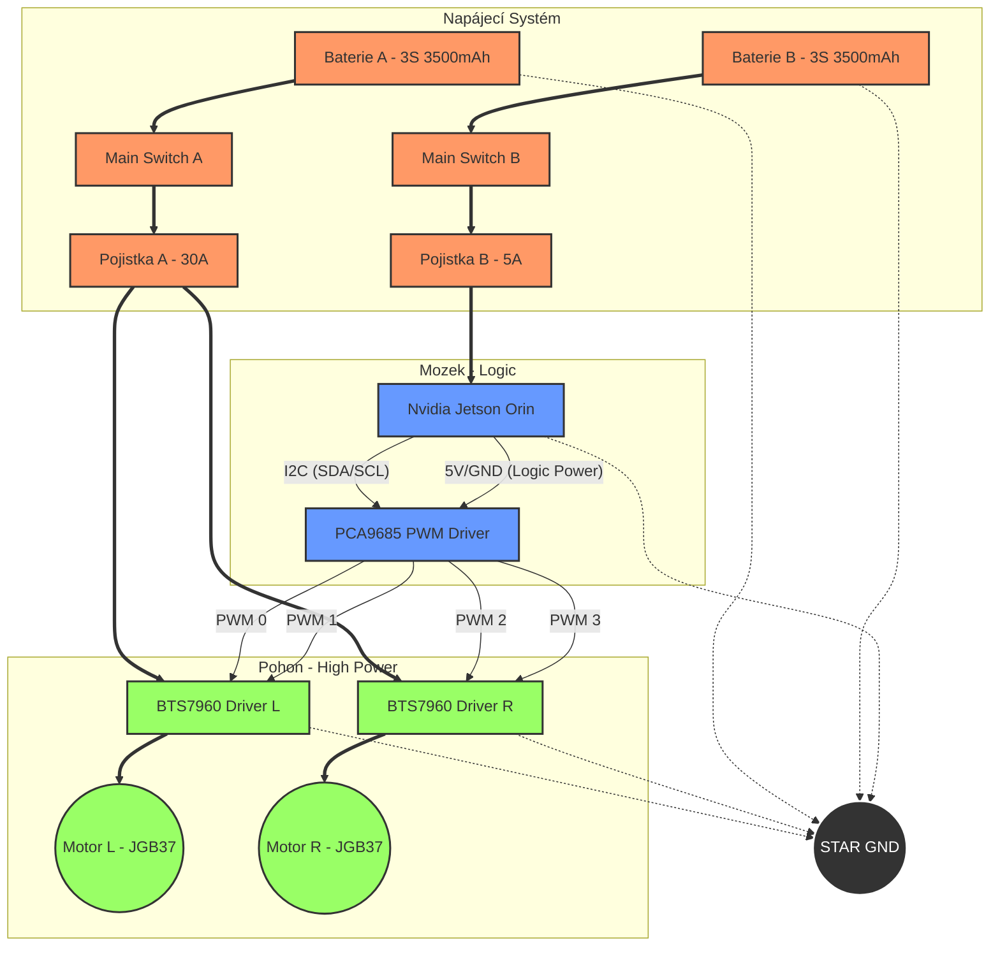

# Vizuální Plán Zapojení (Visual Wiring Diagram)

Zde je schématické znázornění zapojení pomocí Mermaid diagramu. Toto slouží jako "blokové schéma" před tvorbou detailního schématu v CADu.

## Popis Pinů (PCA9685 -> Drivers)
*   **Kanál 0:** Motor L - Vpřed (R_PWM na Driveru L)
*   **Kanál 1:** Motor L - Vzad (L_PWM na Driveru L)
*   **Kanál 2:** Motor R - Vpřed (R_PWM na Driveru R)
*   **Kanál 3:** Motor R - Vzad (L_PWM na Driveru R)
*   **Enable Piny:** R_EN a L_EN na Driverech připojeny trvale na 5V (nebo přes další kanály PCA, pokud chceme "Kill Switch" funkcionalitu).
